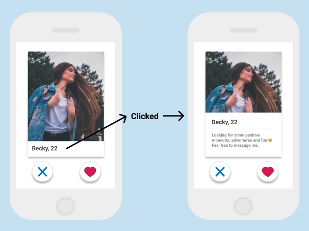
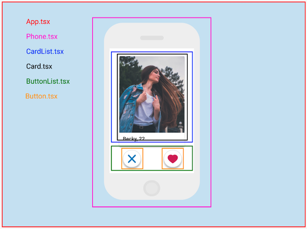

# Tinder UI (技術テスト)

- Web フロントエンドエンジニアインターン by Eureka, Inc.

## Requirements

Tinder のカード UI のような UI を React で実装してください。

- スマホのブラウザ環境で動作すること
- カード数は任意とする
  カードにはユーザーの画像、ニックネーム、年齢を表示する（画像、データは任意）
- カード下の左にスキップボタン、右にいいね！ボタンを表示する
- スキップボタンをタップしたときはカードが左に流れるアニメーションが実行され、次のカードが表示される
- いいね！ボタンをタップしたときはカードが右に流れるアニメーションが実行され、次のカードが表示される
- すべてのカードを仕分けできたら empty 画面が表示される

## Advanced Requirements

- テストを書く
- スワイプでカードを仕分けできる
- カードの下部をタップすると詳細画面が表示される
- API サーバーと連携する

## コードを書く前の計画

### ① UI design

[figma で見てみる](https://www.figma.com/file/rhA8GmUxhmfogwYx7FUggB/Tinder-UI?node-id=0%3A1)

### ② 前回作った[Tinder-UI](https://github.com/tommytommychopper/TinderUI)からの変更点

- 前回はブランチを変えずに`main`で全ての開発を行っていたので今回は機能毎にブランチを切り`イシュードリブンな開発`で進めていく。
- React の考え方でもある`単一責任`+`Reusable`なコンポーネント作りを重視して開発を進めていく。
- テスト開発(テストを書く->テストを成功させるためのコードを書く->リファクター)を取り入れる。
  - コンポーネントが正しくブラウザー上にレンダリングされているか(`Unit Test`)。
  - ボタンを押した時にカードが正しくスワイプされているかどうか(`Integration Test`)。
- `main`ブランチにコードが push された際、[GitHub Actions](https://github.com/features/actions)を使用してテストからプロダクションまでを自動化させる CICD の導入。ホスティングサービスには[Firebase](https://firebase.google.com/?hl=en)を採用。(Requirement では無いですが、個人的に復習したいために導入）
- 開発環境の変更。詳しくは下記 ④ に記載。

### ③ コンポーネント選定

### ④ 開発環境

- [create-react-app -- typescript](https://github.com/facebook/create-react-app)
- [emotion](https://emotion.sh/docs/introduction)
- [react-spring](https://react-spring.io/)
- [react-use-gesture](https://use-gesture.netlify.app/)
- [react-icons](https://react-icons.github.io/react-icons/)
- [unsplash-js](https://www.npmjs.com/package/unsplash-js)
